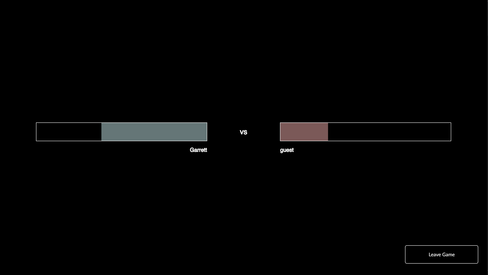
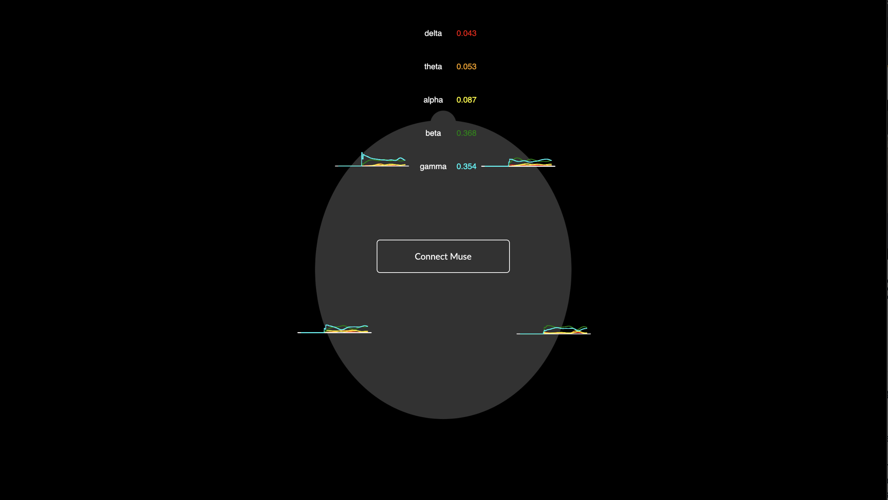
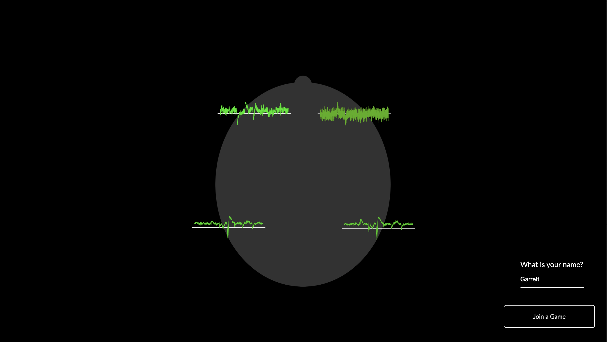
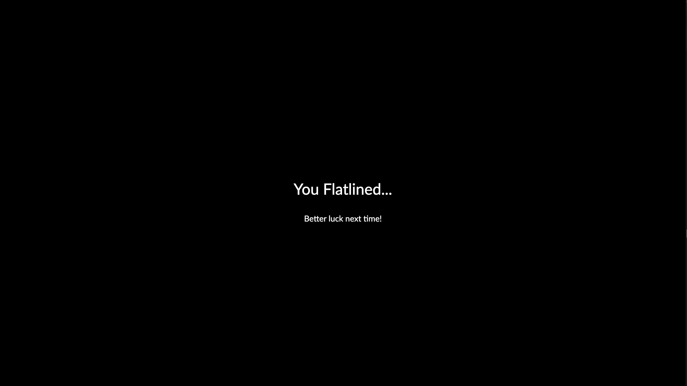

# AlphaBattle
Use alpha power (relaxation) to defend against the beta bursts of your opponent!

## The Story
AlphaBattle was created by [Garrett Flynn](https://www.linkedin.com/in/garrettmflynn/) (USC), [Noel Case](https://www.linkedin.com/in/noel-case-027700185/) (PSU), and [Mona Rahimi](https://www.linkedin.com/in/mona-rahimi/) for the 2021 University of Washington's [Center for Neurotechnology Hackathon](https://www.cnthackathon.org/).

## Media

### Inspect Bandpower Calculation

### Inspect Real-Time Voltage Signal Quality

### AlphaBattle User Interface

### Lose Message

